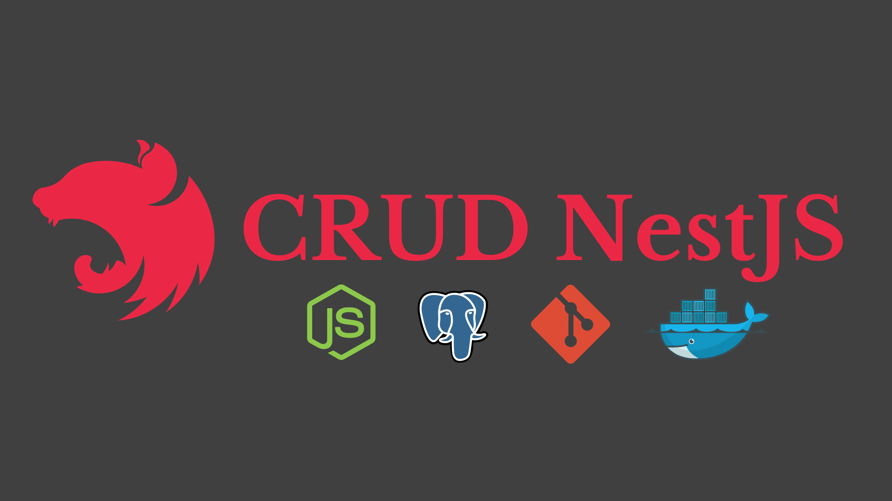

<h1 align="center">
  🚀 CRUD NestJS
</h1>

  

  

  

  

  

  

  <a href="#-tecnologias">Tecnologias</a>&nbsp;&nbsp;&nbsp;|&nbsp;&nbsp;&nbsp;
  <a href="#-projeto">Projeto</a>&nbsp;&nbsp;&nbsp;|&nbsp;&nbsp;&nbsp;
  <a href="#-como-rodar">Como rodar</a>&nbsp;&nbsp;&nbsp;|&nbsp;&nbsp;&nbsp;
  <a href="#-licença">Licença</a>

 

  

## 🚀 Tecnologias

Esse projeto foi desenvolvido com as seguintes tecnologias:

- [NestJS](https://nestjs.com/): framework utilizado para criação da aplicação.
- [Postgres](https://www.postgresql.org/): banco SQL utilizado para armazenar os dados.
- [Docker](https://www.docker.com/) e [Docker-compose](https://docs.docker.com/compose/install/): utilizado para criar e rodar o container do banco de dados.
- [Jest](https://jestjs.io/): utilizado para escrever os testes da aplicação.
- [GitFlow](https://github.com/nvie/gitflow): utilizado no fluxo de desenvolvimento.
- [Swagger](https://swagger.io/): utilizado para documentar a aplicação.

## 💻 Projeto

Esse projeto é um simple CRUD de produtos desenvolvido com o intuito de estudar o framework [NestJS](https://nestjs.com/). Porém aplicando alguns conceitos mais avançados como: TDD, GitFlow, Docker, etc.

## ⚡ Como rodar

### Requisitos

- [Node.js](https://nodejs.org/en/).
- [NestJS CLI](https://docs.nestjs.com/first-steps).
- [Yarn](https://yarnpkg.com/) ou se preferir, pode usar o npm _(já vem com o node)_.
- [Docker](https://www.docker.com/) e [Docker-compose](https://docs.docker.com/compose/install/) _(opcional)_.

### Subir o banco

- crie uma cópia do `.env.example` como `.env` e defina suas variáveis do banco.
- suba o banco de dados com docker: `docker-compose up -d`.

_(se você não estiver usando o docker, é necessário criar o banco manualmente)_.
- rode as migrations: `yarn typeorm migration:run`.

### Rodar a aplicação

- para rodar a aplicação: `yarn start`.
- para rodar a aplicação em modo watch: `yarn start:dev`.
- a aplicação estará disponível no endereço: `http://localhost:3000`.
- a documentação estará disponível no endereço: `http://localhost:3000/api`.

### Rodar os testes

- para rodar os testes unitários: `yarn test`.
- para ver a cobertura dos testes unitários: `yarn test:cov`.
- para rodar os testes e2e: `yarn test:e2e`

## 📝 Licença

Esse projeto está sob a licença MIT. Veja o arquivo [LICENSE](LICENSE.md) para mais detalhes.

---

Feito com ♥ by [Danilo Gonçalves](https://github.com/goncadanilo). Me adicione no [LinkedIn](https://www.linkedin.com/in/goncadanilo/) :wave:
